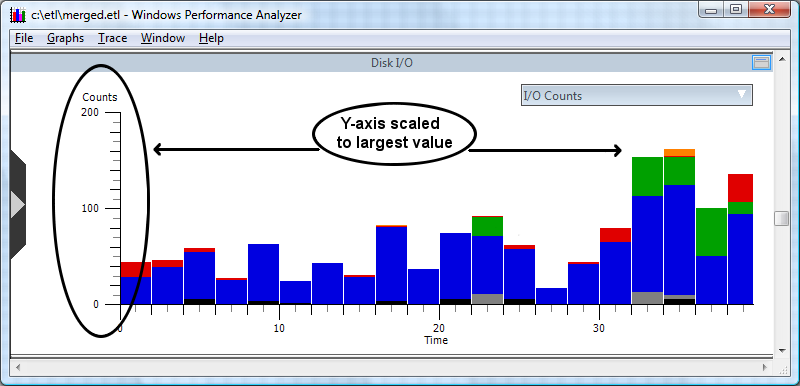
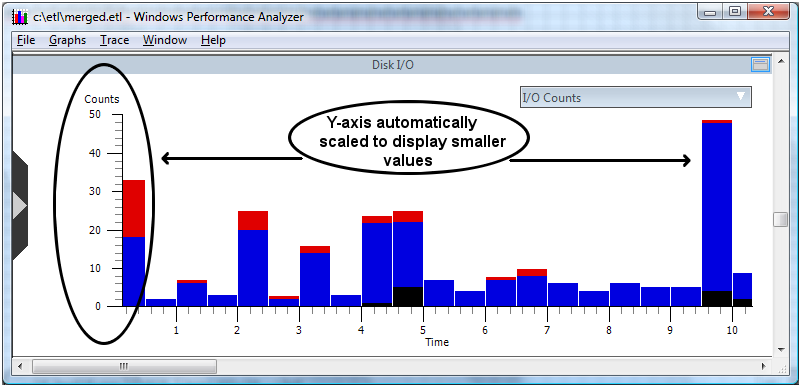

# Y-axis Automatic Rescale

WPA automatically adjusts the Y-axis on a graph. For example, in the folowing screen shot the Y-axis has been scaled to 200 in order to accommodate the large set of buckets that occurs between 32 and 34 seconds of the trace.

When zooming to the time interval from 0 to 10 seconds WPA automatically scales back the Counts as shown in the following screen shot. Automatic rescale affords the user a more well defined view of smaller values and illustrates the time sequence of value changes more clearly.

Additionally, the Y-axis will be rescaled to accommodate values from the legend. For example, a single legend value could cause the graph to scale for a large Y-axis value. If the user removes that legend value using the checkbox, the graph will automatically rescale.

 

 

